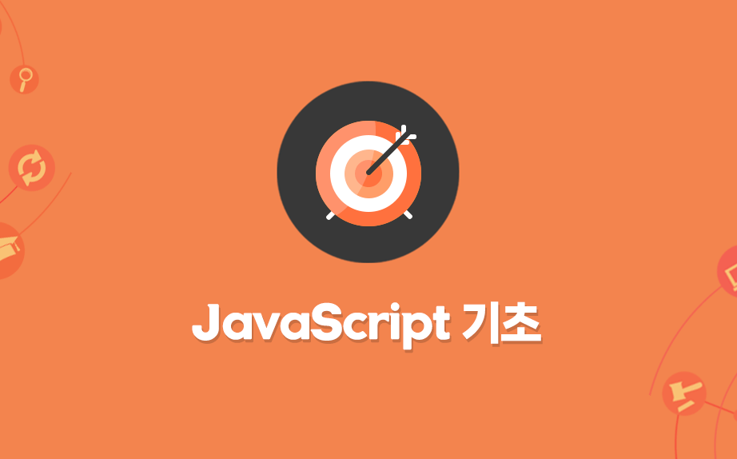
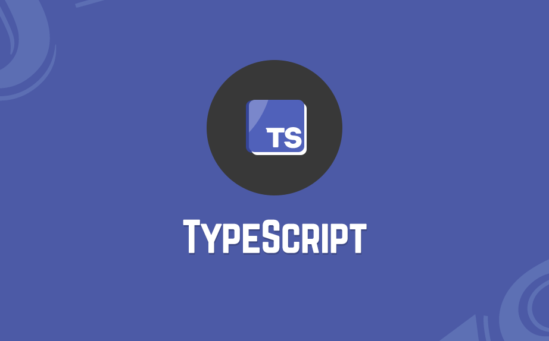

# Study-Web

웹 프로그래밍을 공부하며 정리한 리포지토리 입니다.  

## codingapple_JavaScript-Basic (JavaScript 기초)

각 part 폴더는 해당 강의에서 실습한 소스코드입니다.  

- [x] part0 : 강의 소개와 자바스크립트의 근본
<!--
- [x] part1 : 동적 UI 만드는 스텝 (Alert 박스 만들기)
- [x] part2 : 자바스크립트 function 문법 사용법
- [x] part3 : function의 파라미터 문법
- [x] part4 : 자바스크립트 이벤트리스너
- [x] part5 : 서브메뉴 만들어보기와 classList 다루기
- [x] part6 : jQuery 사용법 간단정리
- [x] part7 : 모달창만들기와 간단한 애니메이션
- [x] part8 : 폼만들며 배워보는 if else
- [x] part9 : 공백검사 숙제와 else if 문법
- [x] part10 : input, change 이벤트와 and, or 연산자
- [x] part11 : if/else, function 실력향상 과제
- [x] part12 : 변수문법과 Dark mode 버튼만들기
- [x] part13 : 변수 심화학습시간 & 저번시간 숙제
- [x] part14 : 변수, 사칙연산 실력향상 과제
- [x] part15 : setTimeout 타이머주는 법
- [x] part16 : 정규식으로 이메일형식 검증해보기
- [x] part17 : 코드 3줄로 캐러셀 (이미지 슬라이드) 만들기
- [x] part18 : 코드 3줄로 캐러셀 (이미지 슬라이드) 만들기 2
- [x] part19 : 함수의 return 문법 & 소수점 다루기
- [x] part20 : 스크롤 이벤트로 만드는 재밌는 기능들
- [x] part21 : 스크롤 이벤트 숙제 해설 & 페이지 스크롤 응용
- [x] part22 : 탭기능 만들며 배우는 for 반복문
- [x] part23 : 탭기능 만들며 배우는 for 반복문 2
- [x] part24 : 이벤트 버블링과 이벤트관련 함수들
- [x] part25 : 이벤트 버블링 응용과 dataset
- [x] part26 : 쓸만한 자바스크립트 라이브러리들
- [x] part27 : Array 와 Object 자료형
- [x] part28 : 약간 복잡한 Array & Object 데이터바인딩
- [x] part29 : 데이터바인딩 숙제 & 문자중간에 변수넣는 법
- [x] part30 : Select 인풋 다루기
- [x] part31 : Select 2 : 자바스크립트로 html 생성하는 법
- [x] part32 : Select 3 : forEach, for in 반복문
- [x] part33 : array, for 반복문 실력향상 과제
- [x] part34 : Ajax 1 : 개념정리
- [x] part35 : Ajax 2 : 상품 더보기 버튼 만들기
- [x] part36 : array에 자주 쓰는 sort, map, filter 함수
- [x] part37 : sort, map, filter 상품정렬기능 숙제
- [x] part38 : DOM이라는 용어 개념정리 & load 이벤트
- [x] part39 : 장바구니 기능과 localStorage
- [x] part40 : 장바구니 기능과 localStorage 숙제
- [x] part41 : position : sticky 활용하기
- [x] part42 : 스크롤 위치에 따라 변하는 애니메이션 : Apple Music UI 만들기
- [x] part43 : 캐러셀에 스와이프 기능 만들기
- [x] part44 : 캐러셀에 스와이프 기능 만들기 숙제 & 터치이벤트
- [x] part45 : 간혹 쓰는 Switch 문법
- [x] part46 : (실전) 웹개발 기능대회 예제
- [x] part47 : 웹개발 기능대회 예제 답안
- [x] part48 : 모던 웹개발시 알아야할 것들

-->

## codingapple_NextJS

각 part 폴더는 해당 강의에서 실습한 소스코드입니다.

<!--
- [x] part0 : Next.js 많이 쓰는 이유를 알아보자
- [x] part1 : Next.js 설치와 개발환경 셋팅
- [x] part2 : 페이지 레이아웃 만들기 (React 기초문법)
- [x] part3 : 여러 페이지 만들기 (라우팅)
- [x] part4 : html을 반복문으로 줄이고 싶으면 map
- [x] part5 : Next.js에서 이미지 넣는 법 2개
- [x] part6 : client/server component, import 문법
- [x] part7 : Component에 데이터 전해주려면 props
- [x] part8 : 좋아요 버튼 만들기 (useState, onClick)
- [x] part9 : 좋아요 버튼 만들기 2 (array, object state 변경하려면)
- [x] part10 : 새로운 프로젝트 생성 / MongoDB 셋팅
- [x] part11 : Next.js에서 MongoDB 사용하기
- [x] part12 : 글목록 조회기능 만들기 (DB 데이터 출력)
- [x] part13 : 상세페이지 만들기 1 (Dynamic route)
- [x] part14 : 상세페이지 만들기 2 (useRouter)
- [x] part15 : 글 작성기능 만들기 1 (서버기능 개발은)
- [x] part16 : 글 작성기능 만들기 2
- [x] part17 : 수정기능 만들기 1
- [x] part18 : 수정기능 만들기 2
- [x] part19 : 삭제기능 만들기 1 (SEO, Ajax)
- [x] part20 : 삭제기능 만들기 2 (Ajax 추가내용과 에러처리)
- [x] part21 : 삭제기능 만들기 3 (query string / URL parameter)
- [x] part22 : static rendering, dynamic rendering, cache
- [x] part23 : JWT, session, OAuth 설명시간
- [x] part24 : 회원기능 만들기 : Auth.js 사용한 소셜로그인
- [x] part25 : 회원기능 만들기 : OAuth + session방식 사용하기
- [x] part26 : 회원기능 만들기 : 아이디/비번 + JWT 사용하기
- [x] part27 : 댓글기능 만들기 1 (input 데이터 다루기)
- [x] part28 : 댓글기능 만들기 2 (useEffect)
- [x] part29 : 댓글기능 만들기 3
- [x] part30 : loading.js, error.js, not-found.js
- [x] part31 : AWS Elastic Beanstalk에 Next.js서버 배포
- [x] part32 : 이미지 업로드 기능 1 (AWS S3 셋팅)
- [x] part33 : 이미지 업로드 기능 2 (Presigned URL)
- [x] part34 : Dark mode 기능 1 (cookies / localStorage)
- [x] part35 : Dark mode 기능 2
- [x] part36 : 서버기능 중간에 간섭하려면 Middleware
- [x] part37 : Next.js의 Server actions 기능

-->

## codingapple_TypeScript

> 각 part 폴더는 해당 강의에서 실습한 소스코드입니다.  
단순 *.ts 파일 실행 시 VSCode Extension [Code Runner](https://marketplace.visualstudio.com/items?itemName=formulahendry.code-runner) 를 사용해서 직접 *.ts 파일을 실행하였음.

- [x] [part0](codingapple_TypeScript/part0/index.ts) : Typescript 필수문법 10분 정리와 설치 셋팅 (Vue, React 포함)
- [x] [part1](codingapple_TypeScript/part1/part1.md) : Typescript 컴파일시 세부설정 (tsconfig.json)
- [x] [part2](codingapple_TypeScript/part2/index.ts) : 타입스크립트 기본 타입 정리 (primitive types)
- [x] [part3](codingapple_TypeScript/part3/index.ts) : 타입을 미리 정하기 애매할 때 (union type, any, unknown)
- [x] [part4](codingapple_TypeScript/part4/index.ts) : 함수에 타입 지정하는 법 & void 타입
- [x] [part5](codingapple_TypeScript/part5/index.ts) : 타입 확정하기 Narrowing & Assertion
<!--
- [x] [part6](codingapple_TypeScript/part6/index.ts) : 타입도 변수에 담아쓰세요 type 키워드 써서 & readonly
- [x] [part7](codingapple_TypeScript/part7/index.ts) : iteral Types로 만드는 const 변수 유사품
- [x] [part8](codingapple_TypeScript/part8/index.ts) : 함수와 methods에 type alias 지정하는 법
- [x] [part9](codingapple_TypeScript/part9/index.ts) : 타입스크립트로 HTML 변경과 조작할 때 주의점
- [x] [part10](codingapple_TypeScript/part10/index.ts) : (JS문법시간) class 키워드 알아보기
- [x] [part11](codingapple_TypeScript/part11/index.ts) : (JS 문법시간) prototype 문법 짚어보기
- [x] [part12](codingapple_TypeScript/part12/index.ts) : class 만들 때 타입지정 가능
- [x] [part13](codingapple_TypeScript/part13/index.ts) : Object에 타입지정하려면 interface 이것도 있음
- [x] [part14](codingapple_TypeScript/part14/index.ts) : 함수 rest 파라미터, destructuring 할 때 타입지정
- [x] [part15](codingapple_TypeScript/part15/index.ts) : Narrowing 할 수 있는 방법 더 알아보기
- [x] [part16](codingapple_TypeScript/part16/index.ts) : 함수에 사용하는 never 타입도 있긴 합니다
- [x] [part17](codingapple_TypeScript/part17/index.ts) : public, private 쓰는거 보니까 타입스크립트 귀여운편
- [x] [part18](codingapple_TypeScript/part18/index.ts) : class에서 사용가능한 protected, static 키워드
- [x] [part19](codingapple_TypeScript/part19/part19.md) : 저번시간 숙제 해설 (class 만들기)
- [x] [part20](codingapple_TypeScript/part20/index.ts) : 타입도 import export 해서 씁니다 그리고 namespace
- [x] [part21](codingapple_TypeScript/part21/index.ts) : 타입을 파라미터로 입력하는 Generic
- [x] [part22](codingapple_TypeScript/part22/index.ts) : React + TypeScript 사용할 때 알아야할 점
- [x] [part23](codingapple_TypeScript/part23/index.ts) : React + TypeScript 사용할 때 알아야할 점 2 : Redux toolkit
- [x] [part24](codingapple_TypeScript/part24/index.ts) : array 자료에 붙일 수 있는 tuple type
- [x] [part25](codingapple_TypeScript/part25/index.ts) : 외부 파일 이용시 declare & 이상한 특징인 ambient module
- [x] [part26](codingapple_TypeScript/part26/index.ts) : d.ts 파일 이용하기
- [x] [part27](codingapple_TypeScript/part27/part27.md) : implements 키워드
- [x] [part28](codingapple_TypeScript/part28/index.ts) : object index signatures
- [x] [part29](codingapple_TypeScript/part29/index.ts) : object 타입 변환기 만들기
- [x] [part30](codingapple_TypeScript/part30/index.ts) : 조건문으로 타입만들기 & infer

-->

# 출처

- codingapple.com
